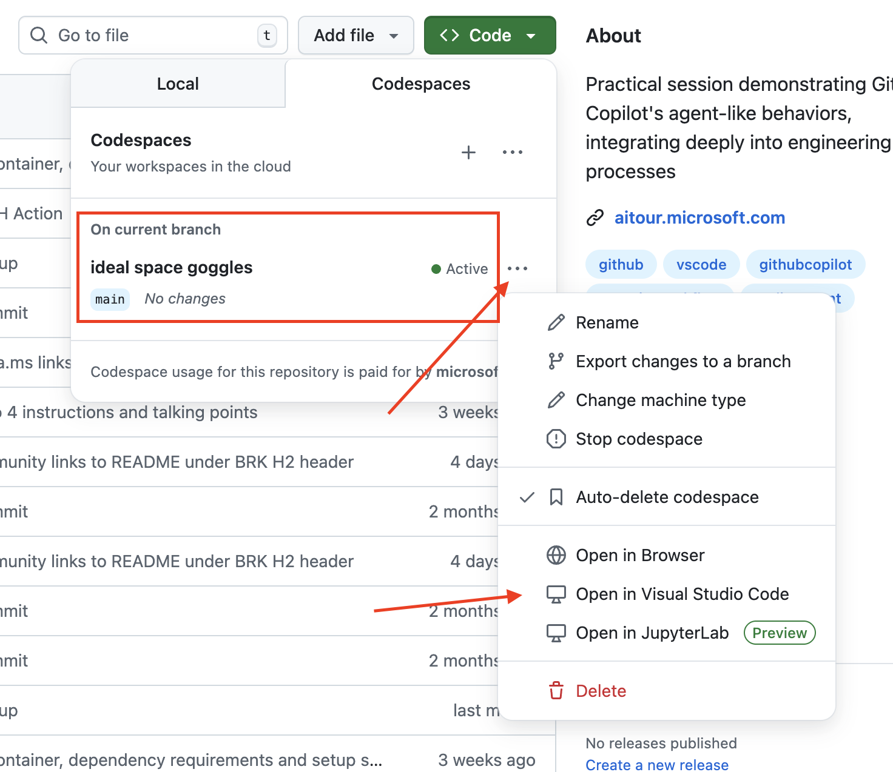
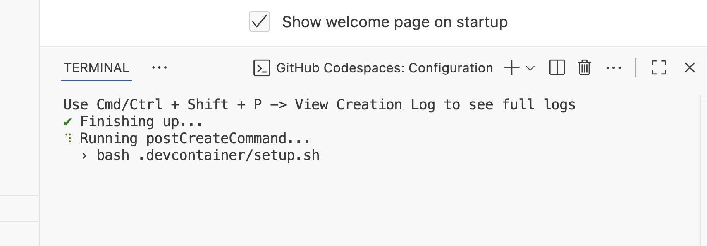

# Demo Setup Instructions: GitHub Copilot as an AI Agent in the Developer Workflow

## Overview

This document provides comprehensive setup instructions for delivering the **BRK442: GitHub Copilot as an AI Agent in the Developer Workflow** session. The session includes 6 demos showcasing GitHub Copilot's capabilities as an AI agent in modern development workflows.

## 🎯 Session Overview

| Demo | Description        | Type 
--------------| --------------- | --------------- |
| Demo 1 | Assign an issue to the Coding Agent | [Recorded Video](https://aka.ms/AAxrxxv) <br> [Instructions](./01-coding-agent-assign-task/coding-agent-assign.md)
| Demo 2 | Review the PR from the Coding Agent | [Backup Recording](https://aka.ms/AAxs5hy) <br> [Live Demo](./02-coding-agent-pr-review/coding-agent-prreview.md)
| Demo 3 | Generate custom instructions  | [Backup Recording](https://aka.ms/AAxrxxu) <br> [Live Demo](./03-custom-instructions/custom-instructions.md)
| Demo 4 | Add tests using Agent mode | [Backup Recording](https://aka.ms/AAxs5hv) <br> [Live Demo](./04-agent-mode-add-tests/add-tests-with-agent-mode.md)
| Demo 5 | Create GitHub issues from project documentation using GitHub MCP Server | [Backup Recording](https://aka.ms/AAxs5hw) <br> [Live Demo](./05-gh-mcp-server/add-mcp.md)
| Demo 6 | Add a SQLite database to the project  | [Recording Video](https://aka.ms/AAxs5hx) <br> [Instructions](./06-db-migration/add-sqldb.md)


## 🔧 Prerequisites & Environment Setup

We strongly recomend you use a Codespace - **via VS Code local**, for the demos as this provides a consistent environment for delivery. If you choose to run the demos locally, please ensure your local environment matches the requirements outlined below.

- [ ] **Codespace setup:** Create a new Codespace on the main branch of this repository
- [ ] **Open in VS Code:** Open the Codespace in Visual Studio Code (locally) using the "Open in VS Code" button in the GitHub web interface
- [ ] **Wait for post-create script to finish:** This will take a few minutes to complete and sets up the Python environment and installs dependencies




### Required Tools

✅ **Essential Tools**
- [ ] **Visual Studio Code** (latest version)
- [ ] **GitHub Copilot** (latest version)
- [ ] **GitHub Copilot Chat** (latest version)
- [ ] **GitHub Pull Requests** VS Code extension installed
- [ ] **Python 3.7+** with virtual environment support (this is run through a script on startup)

### GitHub Setup

✅ **Repository Requirements**
- [ ] Access to the demo repository with appropriate permissions to review and create issues/PRs
- [ ] GitHub Copilot subscription (Premium for Coding Agent features)
- [ ] Sample Pull Request created by the Coding Agent, ready for the review scenario

### VS Code Configuration

✅ **Extensions & Settings**
- [ ] Local Codespace VS Code instance opens without errors
- [ ] GitHub Copilot is signed in and active
- [ ] GitHub Pull Requests extension can access the repository
- [ ] Python virtual environment activates and installs dependencies successfully within the local Codespace instance without errors
- [ ] Configure workspace to open the `src` folder for Python demos

### Python Environment Setup (if running locally) - NOT NEEDED IF USING A CODESPACE FOR THE DEMOS

✅ **Virtual Environment**
```bash
# Create and activate virtual environment
python -m venv .venv
source .venv/bin/activate  # On Windows: .venv\Scripts\activate

# Install required packages
pip install -r requirements.txt

# Verify pytest installation
pytest --version
```

✅ **Required Python Packages**
These are installed with the setup script when using a local Codespace, but if running locally, ensure these are installed:
- [ ] Flask (for the demo application)
- [ ] pytest (for testing demos)
- [ ] SQLAlchemy (for database demos, if doing live)
- [ ] selenium (for E2E testing demos - extra)

## 🎬 Demo-Specific Setup Instructions

### Demo 1: Coding Agent Assignment
**Setup Requirements:**
- [ ] **Note:** This demo uses a recorded demo video for consistency and time efficiency
- [ ] Ensure the Codeing Agent Pull Request is already created on the repository as this will be needed in future demos
- [ ] If there is **NO** Pull Request on the repository, assign issue _[Add a User Interface (UI) to the Product Store Demo Application #2](https://github.com/microsoft/aitour26-BRK442-github-copilot-as-an-ai-agent-in-the-developer-workflow/issues/2)_ to the Coding Agent to create a PR (this takes about 15 mins to complete so ensure this is done well in advance of the session)
- [Demo notes](./01-coding-agent-assign-task/coding-agent-assign.md)

### Demo 2: PR Review Process
**Setup Requirements:**
- [ ] Open a local Codespace of this repository in VS Code
- [ ] Ensure the PR created by the Coding Agent from Demo 1 exists (check with the GitHub extension Pull Request panel)
- [ ] GitHub Pull Request extension properly authenticated
- [ ] Test the PR review workflow beforehand, but **DO NOT** submit a review before the demo
- [Demo notes](./02-coding-agent-pr-review/coding-agent-prreview.md)

### Demo 3: Custom Instructions
**Setup Requirements:**
- [ ] Copilot Chat panel authenticated and accessible
- [ ] Prepare to demonstrate custom-instruction generation
- [ ] **Important:** Ensure the generated instructions include specific test code templates found in [Generate Custom Instructions](../03-custom-instructions/custom-instructions.md) 
- [Demo notes](./03-custom-instructions/custom-instructions.md)

### Demo 4: Agent Mode Testing
**Setup Requirements:**
- [ ] App running and available at http://localhost:5000 and terminal virtual environment activated with the dependency requirements installed. To test the app is running correctly, go to http://localhost:5000/products and you will see an empty product list
- [ ] `test_app.py` file should be present but **empty**
- [ ] Custom instructions from Demo 3 should be configured correctly, including the test code templates
- [ ] Terminal ready to run pytest commands within the virtual environment (venv)
- [Demo notes](./04-agent-mode-add-tests/add-tests-with-agent-mode.md)

### Demo 5: MCP Server Integration
**Setup Requirements:**
- [ ] **CRITICAL:** Uninstall GitHub MCP Server if previously installed as the install flow of this MCP server is the demo
- [ ] VS Code extensions panel accessible
- [ ] Be prepared to authenticate with GitHub during MCP server installation flow
- [ ] Project documentation available for creating issues in GitHub
- [Demo notes](./05-gh-mcp-server/add-mcp.md)

### Demo 6: Database Migration
**Setup Requirements:**
- [ ] **Note:** Uses recorded demo video

If running live:
- [ ] SQLite development environment ready
- [ ] SQLite Viewer extension installed into the local VS Code Codespace instance
- [ ] MS Docs MCP server installed and available for best practice retreival
- [Demo notes](./06-db-migration/add-sqldb.md)

## 🚀 Pre-Demo Checklist

### Functionality Testing
- [ ] Copilot Chat responds to test prompts
- [ ] Agent mode is accessible in Copilot Chat
- [ ] MCP Servers section visible in VS Code extensions
- [ ] pytest runs successfully on sample tests
- [ ] Flask application starts on localhost:5000

### Content Preparation
- [ ] Demo recordings are accessible and tested (for demo 1 and 6)
- [ ] Live demo scripts are rehearsed
- [ ] Fallback plans prepared for live demos (demo recordings are quickly accessible)
- [ ] All demo prompts are saved and easily accessible


### Delivery Best Practices
- **Rehearse:** Practice all live demos multiple times
- **Backup Plans:** Have recorded versions of live demos as fallbacks
- **Stay Current:** GitHub Copilot UI changes frequently - verify current interface and minor changes to avoid surprises
- **Custom Instructions:** Emphasize importance for code quality and security
- **Real-world Context:** Connect each demo to the practical development scenario for Zava

## 🆘 Troubleshooting

### Common Issues
- **Copilot Not Active:** Check subscription and sign-in status
- **MCP Server Issues:** Ensure proper installation of MCP Servers
- **Python Environment:** Verify virtual environment activation
- **GitHub Authentication:** Confirm repository access permissions
- **Extension Conflicts:** Disable non-essential VS Code extensions that may interfere, even when using a local Codespace

### Emergency Procedures
- Switch to recorded demos if live demos fail
- Have a backup GitHub repository ready
- Keep simplified demo scripts for time constraints
- Prepare alternative prompts if specific examples don't work for you

## 📝 Post-Demo Actions

- [ ] Clean up demo environment / delete local Codespace instance - ** Do NOT commit any changes to the repository main branch! **
- [ ] Reset you local MCP Server installations
- [ ] Unassign issue _[Add a User Interface (UI) to the Product Store Demo Application #2](https://github.com/microsoft/aitour26-BRK442-github-copilot-as-an-ai-agent-in-the-developer-workflow/issues/2)_ from the Coding Agent on the repository ready for the next delivery
- [ ] Collect feedback for future improvements
- [ ] Update setup instructions based on experience

---

**Session Delivery Contact:** For questions about content or delivery, reach out to the content leads listed in the main repository README.

**Last Updated:** Review and update these instructions before each delivery to ensure accuracy with the latest GitHub Copilot features.